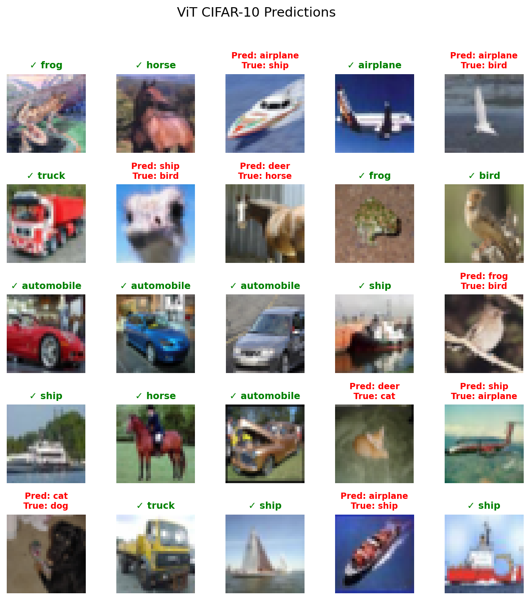

# Vision Transformer (ViT) Implementation for CIFAR-10

## Project Overview

Vision Transformer (ViT) implementation from scratch for image classification on CIFAR-10 dataset

## Key Components

### 1. Patch Projection
- Split images into patches
- Linear projection using Conv2d
- Input: (batch, 3, 224, 224) → Output: (batch, 196, 768)

### 2. Patch Embedding
- Add CLS token
- Apply positional encoding
- Input: (batch, 3, 224, 224) → Output: (batch, 197, 768)

### 3. Multi-Head Attention (MHA)
- 12 attention heads
- Scaled dot-product attention
- QKV projection and output projection

### 4. Transformer Encoder Block
- Pre-normalization with LayerNorm
- MHA + Residual connection
- MLP (4x hidden dimension) + Residual connection

### 5. Vision Transformer
- 12 Transformer blocks
- Classification head with CLS token

## Training Results

### Performance
- **Final Test Accuracy**: 69.08%
- **Training Time**: ~2.5 hours (30 epochs, MPS)
- **Model Size**: 4.77M parameters

### Training Configuration
```python
- Optimizer: AdamW (lr=5e-4, weight_decay=0.03)
- Scheduler: Cosine annealing with warmup
- Batch size: 256
- Label smoothing: 0.1
```

## Prediction Results



## Model Configuration Comparison

| Configuration | Embedding Size | Depth | Heads | Parameters |
|--------------|---------------|-------|--------|------------|
| ViT-Tiny     | 192          | 12    | 3      | 5.7M       |
| ViT-Small    | 384          | 12    | 6      | 22M        |
| ViT-Base     | 768          | 12    | 12     | 86.5M      |
| ViT-Large    | 1024         | 24    | 16     | 304M       |

## CIFAR-10 Adaptations

- Image size: 32x32 (instead of original 224x224)
- Patch size: 4x4 (instead of original 16x16)
- Total patches: 64

## References

- [An Image is Worth 16x16 Words (Paper)](https://arxiv.org/abs/2010.11929)
- [Vision Transformer (Google Research)](https://github.com/google-research/vision_transformer)
- [CIFAR-10 Dataset](https://www.cs.toronto.edu/~kriz/cifar.html)
